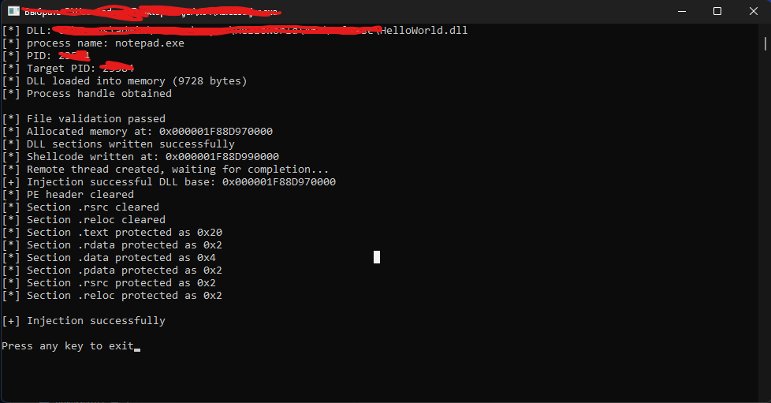

# GhostManualLoad-Manual-map-injector
Windows DLL manual mapping loader with import resolution, relocations, TLS callbacks, and optional SEH support.

This project is a Windows DLL loader that implements manual mapping of PE images into a remote process without using LoadLibrary for the main module.
The loader parses and maps the PE file manually, applies base relocations, resolves imports, executes TLS callbacks, and calls the module entry point (DllMain) inside the target process.
The implementation supports both x86 and x64 architectures, includes optional SEH exception support on x64, and allows post-mapping memory cleanup such as clearing PE headers, unused sections, and adjusting memory protections for stealth and correctness.
The project is intended for educational and research purposes, focusing on Windows PE internals, process memory manipulation, and runtime image loading.

Discord : zeonriver
